# Cyndi Taylor Website Bot

This project implements an automated agent that helps Cyndi Taylor update her website (cynditaylor.com) without requiring technical knowledge.

## Workflow

```mermaid
sequenceDiagram
    participant Cyndi as Cyndi Taylor
    participant Agent as Website Bot Agent
    participant GitHub as GitHub Repository
    participant Actions as GitHub Actions
    participant Website as cynditaylor.com

    Cyndi->>Agent: Sends email/text with change request
    Note over Cyndi,Agent: Request may include text instructions and image attachments

    Agent->>GitHub: Pulls latest website code
    Agent->>Agent: Makes requested changes to code
    Agent->>GitHub: Commits and pushes changes

    GitHub->>Actions: Triggers build workflow
    Actions->>Website: Builds and deploys website

    Agent->>Actions: Monitors deployment status
    Actions->>Agent: Deployment complete

    Agent->>Cyndi: Sends confirmation with website link
    Cyndi->>Website: Views the changes

    alt Happy with changes
        Cyndi->>Agent: Sends approval feedback
        Agent->>Agent: Records positive feedback
        Note over Cyndi: Happy with the result! 😊
    else Needs adjustments
        Cyndi->>Agent: Requests further changes
        Agent->>Agent: Records feedback
        Note over Agent: Process repeats until Cyndi is satisfied
    end
```



## Purpose

This agent serves as an intermediary between Cyndi Taylor and her website's codebase. It allows her to:

1. Request changes to her website through simple instructions
2. Upload new images of paintings
3. Update content and styling
4. Receive confirmation when changes are live
5. Provide feedback on the changes

The agent handles all the technical aspects of:

- Code modification
- Version control
- Deployment
- Monitoring
- Communication

## Implementation

This project implements the agent that processes requests, makes the appropriate code changes, and manages the deployment process.

### Project Structure

- `src/`: Source code directory
  - `main.py`: Entry point that initializes the agent and passes instructions
  - `config.py`: Configuration settings
  - `llm/`: Directory for LLM-related code
    - `provider.py`: Abstract base class for LLM providers
    - `frank_provider.py`: Implementation for the "Frank" LLM with tools support
  - `agent/`: Directory for agent-related code
    - `agent.py`: Main agent implementation using tools
    - `tools/`: Directory for tools the agent can use
      - `file_tools.py`: Tools for reading/writing files
      - `git_tools.py`: Tools for git operations
- `tests/`: Unit tests
- `requirements.txt`: Project dependencies

### LLM Abstraction

The project uses an abstraction around the LLM API, making it easy to switch between different LLM providers. Currently, it includes a placeholder implementation for the "Frank" LLM, which can be replaced with a real LLM API integration.

To add a new LLM provider:

1. Create a new class that implements the `LLMProvider` interface
2. Update the `get_llm_provider()` function in `main.py` to use the new provider
3. Update the configuration in `config.py` as needed

## Setup

1. Clone the repository:
   ```
   git clone https://github.com/username/cynditaylor-com-bot.git
   cd cynditaylor-com-bot
   ```

2. Install dependencies:
   ```
   pip install -r requirements.txt
   ```

3. Set up environment variables (optional):
   ```
   export WEBSITE_DIR=path_to_website_directory
   ```

   Or create a `.env` file with these variables.

## Usage

Run the agent with a default instruction:

```
./run
```

Or provide a custom instruction:

```
./run "Update the contact information to include a new email address"
```

Alternatively, you can run the module directly:

```
python -m src.main "Update the contact information to include a new email address"
```

## Testing

Run the tests:

```sh
./test
```


Alternatively, you can run the tests directly:

```
python -m unittest discover tests
```
