# Cyndi Taylor Website Bot

This project implements an automated agent that helps Cyndi Taylor update her website (cynditaylor.com) without requiring technical knowledge.

## Workflow

```mermaid
sequenceDiagram
    participant Cyndi as Cyndi Taylor
    participant Agent as Website Bot Agent
    participant GitHub as GitHub Repository
    participant Actions as GitHub Actions
    participant Website as cynditaylor.com

    Cyndi->>Agent: Sends email/text with change request
    Note over Cyndi,Agent: Request may include text instructions and image attachments

    Agent->>GitHub: Pulls latest website code
    Agent->>Agent: Makes requested changes to code
    Agent->>GitHub: Commits and pushes changes

    GitHub->>Actions: Triggers build workflow
    Actions->>Website: Builds and deploys website

    Agent->>Actions: Monitors deployment status
    Actions->>Agent: Deployment complete

    Agent->>Cyndi: Sends confirmation with website link
    Cyndi->>Website: Views the changes

    alt Happy with changes
        Cyndi->>Agent: Sends approval feedback
        Agent->>Agent: Records positive feedback
        Note over Cyndi: Happy with the result! 😊
    else Needs adjustments
        Cyndi->>Agent: Requests further changes
        Agent->>Agent: Records feedback
        Note over Agent: Process repeats until Cyndi is satisfied
    end
```

## Purpose

This agent serves as an intermediary between Cyndi Taylor and her website's codebase. It allows her to:

1. Request changes to her website through simple instructions
2. Upload new images of paintings
3. Update content and styling
4. Receive confirmation when changes are live
5. Provide feedback on the changes

The agent handles all the technical aspects of:

- Code modification
- Version control
- Deployment
- Monitoring
- Communication

## Implementation

This project implements the agent that processes requests, makes the appropriate code changes, and manages the deployment process.

## Setup

[Setup instructions will be added as the project develops]
